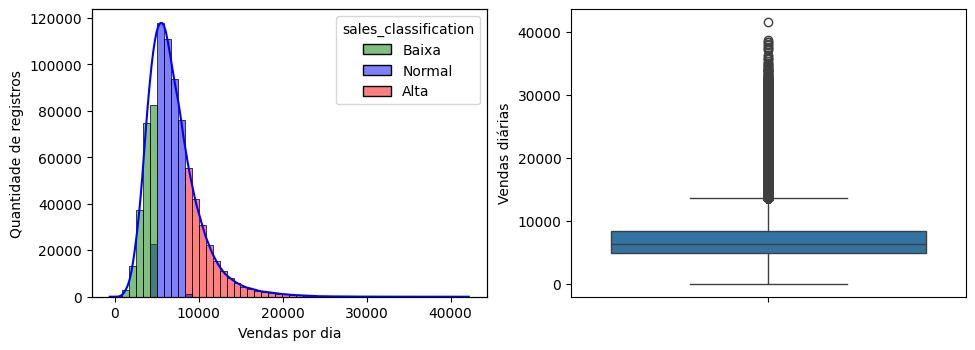

<h3 style='text-align: center; color: black;'><strong>Bruno Varella Motta da Costa</strong></h3>
<h4 style='text-align: center; color: black;'><a href="https://www.linkedin.com/in/brunovmcosta/">Linkedin</a></h4>

# Apresentação

Este projeto foi desenvolvido para atender uma solicitação do CFO da rede de farmácias Rossmann quanto à previsão das vendas diárias para um período de 6 semanas. O CFO desejava investir nas lojas Rossmann para aumentar as vendas diárias baseando-se em evidências (dados pretéritos). Quais insights poderiam ser obtidos da série temporal das lojas para aumentar as vendas diárias? Além disso, o CFO desejava obter a receita total de cada loja para o período das previsões. A equipe de cientista de dados da Rossmann atendeu a solicitação do CFO construindo uma API para disponibilizar a receita de determinada loja ao longo das próximas 6 semanas. A receita semanal foi prevista utilizando modelo de machine learning.
 

# Desenvolvimento

Este projeto de ciência de dados foi desenvolvido em 10 etapas. A primeira etapa consistiu de conversas com os gerentes das lojas para entendimento do problema de negócio e elaboração das principais hipóteses quanto ao fenômeno analisado (vendas diárias) (Figura 1). Um mapa mental mostrando o fenômeno analisado com as principais entidades e seus atributos foi construído. Os resultados apresentados no arquivo projeto_rossmann_final.ipynb fazem parte do primeiro ciclo de trabalho conforme proposto pelo método <em>Cross-Industry Standard Process for Data Science</em> (CRISP-DS) (Figura 2).
 

Figura 1

Figura 2

As vendas diárias das lojas Rossmann não seguem uma distribuição normal porque há períodos em que as vendas são muito altas (Figura 3).
 

# Principais Insights 
>>
>> - A Rossmann deve aumentar a quantidade de lojas com sortimento 'extra', que apresentam a maior mediana de vendas diárias (€ 8088/dia).
>>
>> - A Rossmann deve explorar a proximidade de concorrentes visto que esse fator favorece um aumento nas vendas diárias. Isso provavelmente ocorre porque regiões com muitas farmácias atraem mais pessoas.
>>
>> - O período máximo de promoção deve ser definido com base na série temporal de vendas de cada loja. Ao considerar todas as lojas, o período máximo de promoção foi 50 semanas.
>>
>> - A Rossmann deve aumentar a quantidade de lojas abertas no Natal e na primeira semana do período de Páscoa.
>>
>> - A Rossmann deve explorar promoções em períodos com tendência de redução nas vendas como os 10 dias iniciais de cada mês e de terça a sábado.   
>>
>>
# Perspectivas
>>
>>
 Os novos ciclos de trabalho da equipe de cientistas de dados incluirão a variável 'customers' no algoritmo de aprendizado de machine learning visto que tem efeito importante sobre as vendas diárias. Um projeto específico para previsão de quantidade de clientes nas lojas será desenvolvido.
 
>>

# Ferramentas utilizadas
>>
>> - <em>Python</em> (versão 3.9.21), <em>Scikit-learn</em> e algoritmos de aprendizado de máquina.
>> - Bibliotecas contidas no arquivo requirements.txt
>> - WSL para gerenciamento de ambiente virtual.
>> - Git para versionamento dos arquivos e envio para o repositório Github.
>> - Jupyter notebook para ajuste dos modelos de aprendizado de máquina
>> - VS Code para construção do arquivo Readme.md

# Habilidades Desenvolvidas
>>
>> - Análise de dados.
>> - Utilização de algoritmos supervisionados de aprendizado de máquina
>> - Utilização de algoritmos não supervisionados de aprendizado de máquina
>> - Interpretação de métricas de performance dos algoritmos

